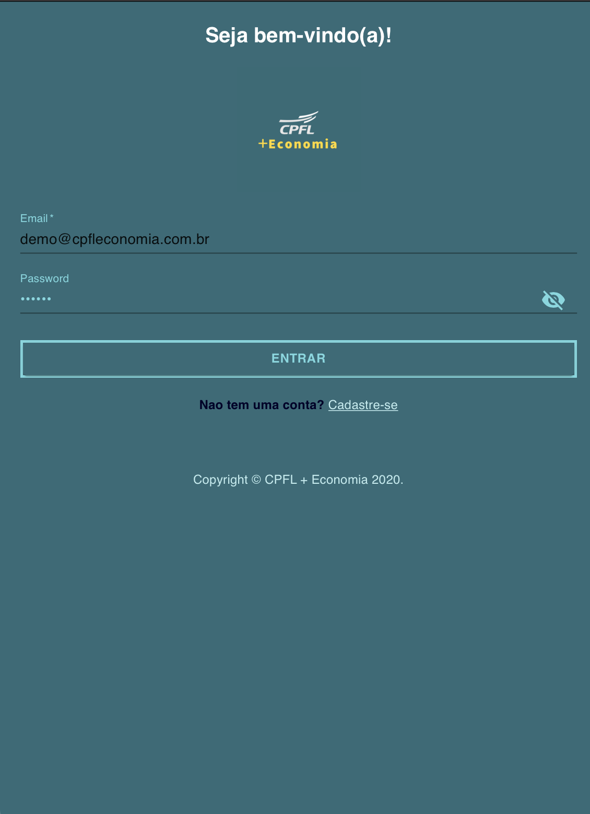
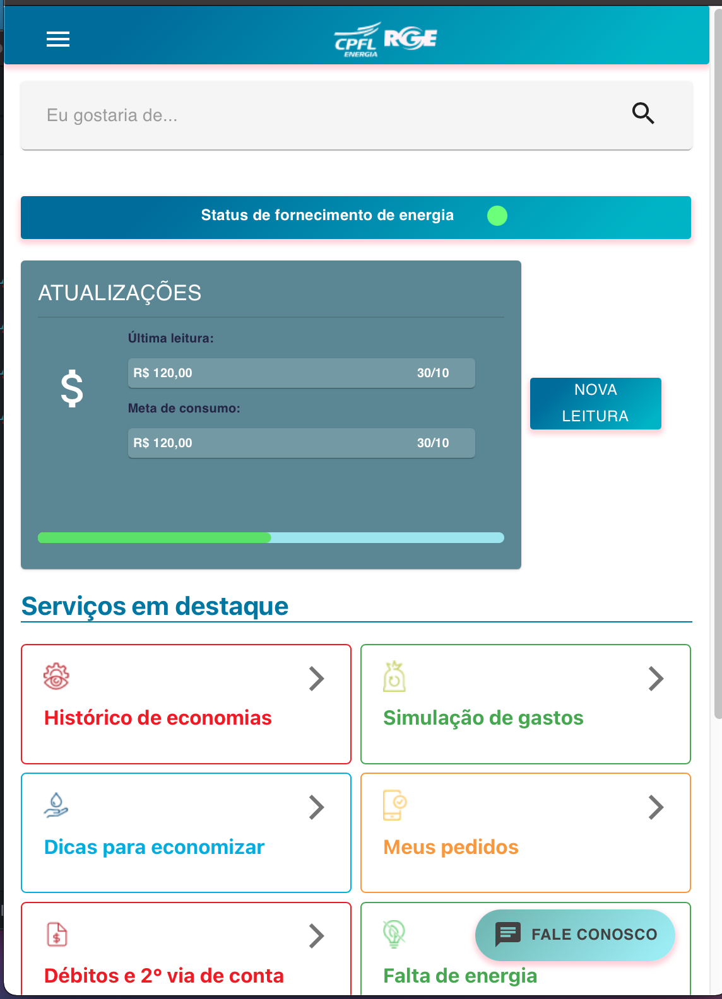
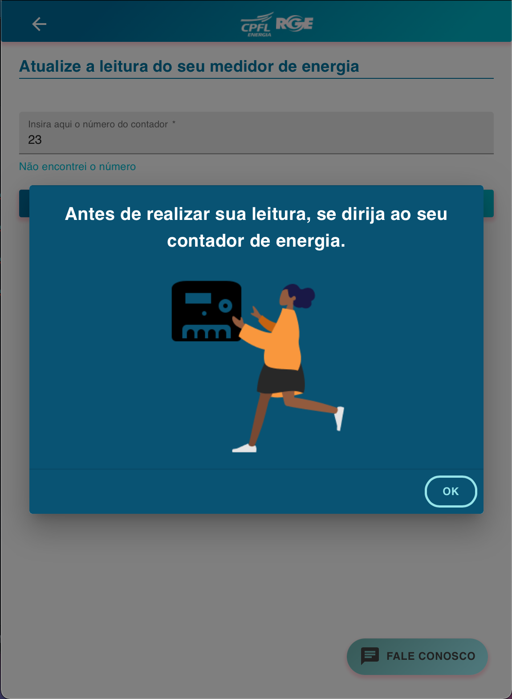
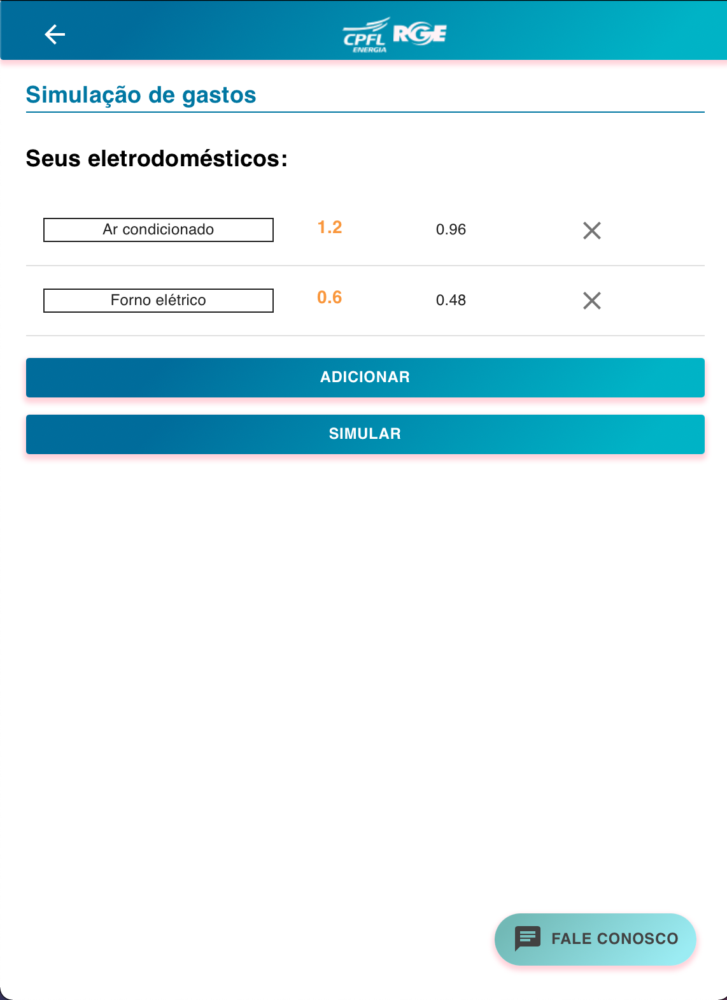

<h2 align="center">Raízes do Saber</h2>

  

<table>
  <tr>
    <td></td>
    <td></td>
    <td></td>
    <td></td>
  </tr>
</table>

## :information_source: Sobre
- SWAGGER: <a href="https://megahack5.brunoeleodoro.com/api-docs/">https://megahack5.brunoeleodoro.com/api-docs/</a>
- PWA: <a href="https://brunoeleodoro.github.io/megahack4_front/">https://brunoeleodoro.github.io/megahack4_front/</a>

## :information_source: Sobre

Através do aplicativo o usuário poderá fazer uma auto leitura do seu medidor de consumo elétrico. Além de inserir uma meta e os eletrodomésticos e aparelhos elétricos possui em sua residência, nosso app fará uma análise de consumo, entregando ao usuário uma estimativa do valor da próxima fatura.Nosso app também irá disponibilizar tutoriais e dicas promovendo o consumo racional de energia.

## :rocket: Tecnologias Utilizadas

O projeto foi desenvolvido utilizando as seguintes tecnologias

- React (Material-UI) front end
- Backend com Nodejs
- Mongodb database
- Swagger para documentar as APIS

## ✍ Autores

👤 **Victor Bilis**

* Github: [@victorbilisambipar](https://github.com/victorbilisambipar)

👤 **Bruno Eleodoro**

* Github: [@BrunoEleodoro]( https://github.com/BrunoEleodoro)

👤 **Rodrigo Temoteo**

* Github: [@rodrigoatemoteo]( https://github.com/rodrigoatemoteo)
